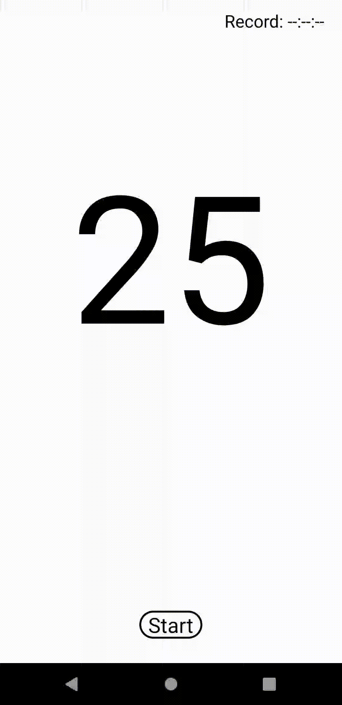

# Game25
Creating a game for Android
Here I will create an Android game step by step and share my steps.
### Step 1. How will game look like?
So the 1st step is planning on paper about how will your game look like.
#### The Main Page will look


There will be `"Start"` button after pressing the `"Start"` button you will go to **Game Page.** In the picture you can see the `"Record: --:--:--"` there we will keep our record.

#### The Game Page will look


There will be `"Back"` button for quitting the game. `"Restart"` button to shuffle the numbers. `"Time: --:--:--"` to show how many time we spend to pushing numbers `from 1 to 25`.

### Step 2. Creating an XML files.
#### Main Activity XML
We have write Main Activities XML file. You can see the source code in `activity_main.xml` file.
#### Game Page XML
We have write Game Page XML file. You can see the source code in `game.xml` file.
### Step 3. Coding
#### MainActivity & Game
I have added functionality to the two buttons:
1. Button `Start` in **MainActivity**
2. Button `Back` in **Game**

You must write code below to jump from `CurrentActivity` to `FinalActivity`:
```
Intent intent = new Intent(CurrentActivity.this, FinalActivity.class);
startActivity(intent);
finish();
```


#### Method init() in Game.class
I have added the functionality to `Restart` button in **Game**. And now you can play the game.


#### Adding StopWatch
Finally added StopWatch:

