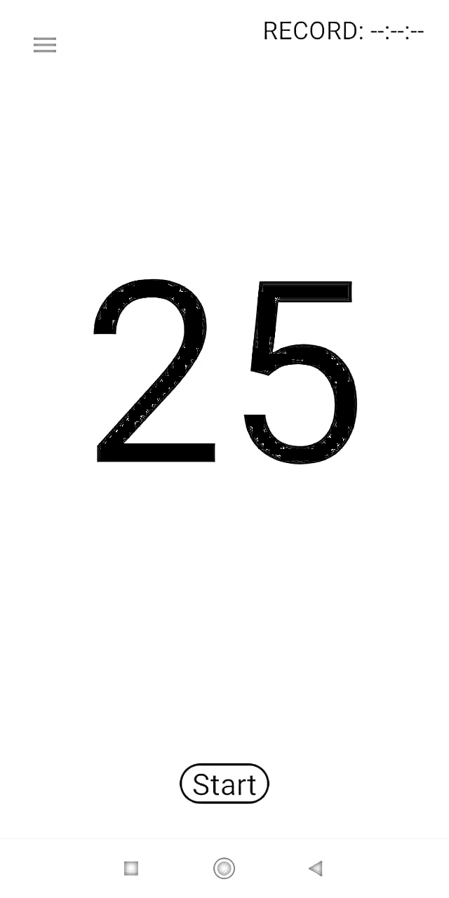
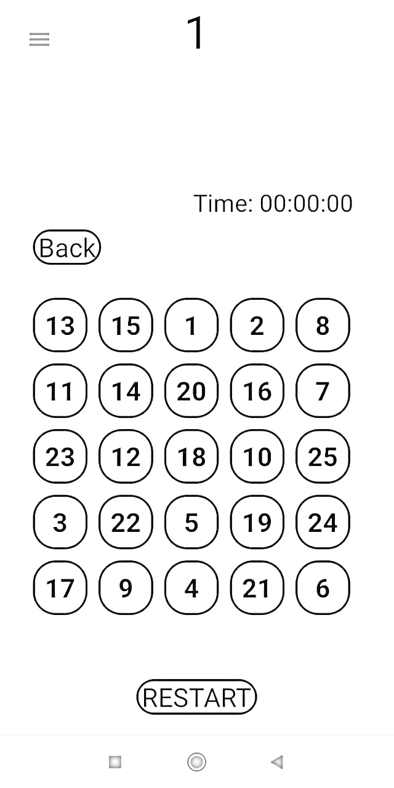

# Game25
Creating a game for Android
Here I will create an Android game step by step and share my steps.
### Step 1. How will game look like?
So the 1st step is planning on paper about how will your game look like.
#### The Main Page will look

There will be `"Start"` button after pressing the `"Start"` button you will go to **Game Page.** In the picture you can see the `"Record: --:--:--"` there we will keep our record.

#### The Game Page will look

There will be `"Back"` button for quitting the game. `"Restart"` button to shuffle the numbers. `"Time: --:--:--"` to show how many time we spend to pushing numbers `from 1 to 25`.

### Step 2. Creating an XML files.
#### Main Activity XML
We have write Main Activities XML file. You can see the source code in `activity_main.xml` file.
